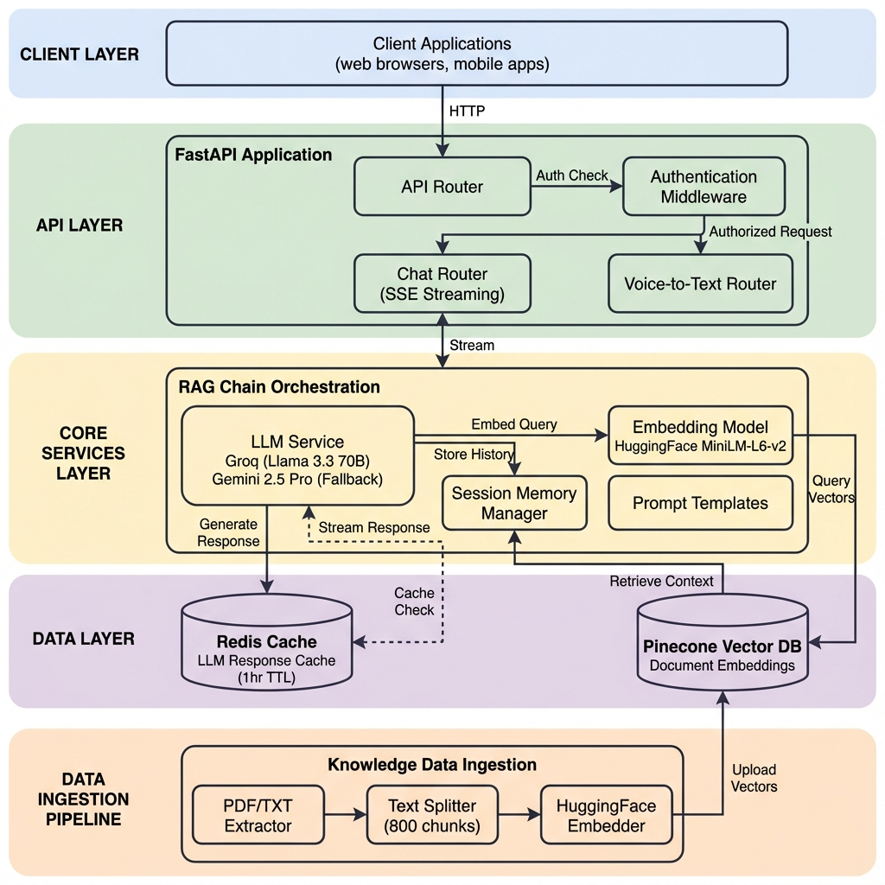
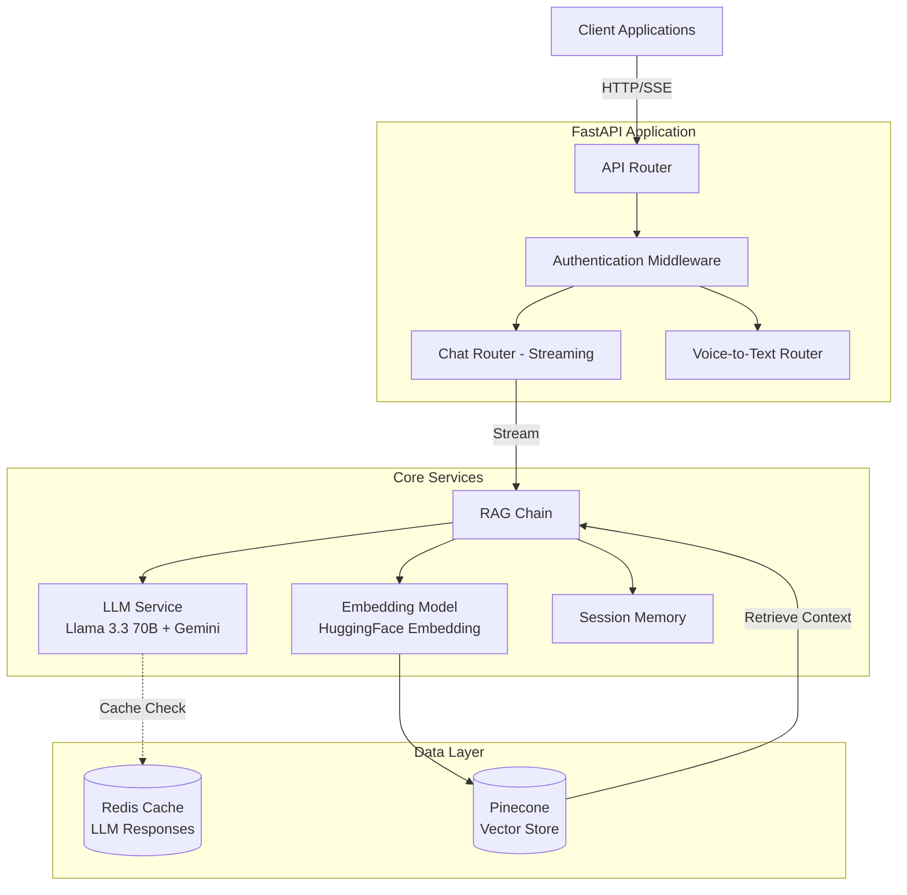

# A Production-Ready Enterprise RAG Chatbot Microservice with FastAPI Streaming, Redis Caching, and High-Performance LLM Inference

A production-ready **Retrieval-Augmented Generation (RAG)** chatbot API built with **FastAPI**, featuring real-time streaming responses, **Groq Llama 3.3 70B** and **Gemini 2.5 Pro** LLMs, **HuggingFace embeddings**, Redis-based LLM caching, Pinecone vector database, and an automated **knowledge data ingestion pipeline**.

---

## 🚀 Features

- **🔄 Streaming Responses**: Real-time Server-Sent Events (SSE) for instant user feedback
- **⚡ Redis LLM Caching**: Intelligent caching layer to reduce latency and API costs
- **🧠 RAG Architecture**: Context-aware responses using vector similarity search
- **🔐 API Key Authentication**: Secure endpoints with custom API key validation
- **💬 Session Management**: Persistent conversation history across multiple turns
- **🎯 Dual LLM Support**: Groq Llama 3.3 70B primary with Gemini 2.5 Pro fallback for reliability
- **🤖 HuggingFace Embeddings**: Lightweight sentence-transformers/all-MiniLM-L6-v2 model
- **� Knowledge Data Ingestion**: Automated pipeline for PDF/TXT document processing and vectorization
- **�🐳 Docker Ready**: Containerized deployment with Docker Compose
- **📊 Structured Logging**: Comprehensive logging for monitoring and debugging

---

## 🏗️ System Architecture



### Architecture Overview



### Key Components

| Component | Technology | Purpose |
|-----------|-----------|---------|
| **API Framework** | FastAPI | High-performance async web framework |
| **Primary LLM** | Groq Llama 3.3 70B | Fast text generation with streaming support |
| **Fallback LLM** | Gemini 2.5 Pro | Backup LLM provider for reliability |
| **Vector Database** | Pinecone | Semantic search and document retrieval |
| **Cache Layer** | Redis | LLM response caching (1-hour TTL) |
| **Orchestration** | LangChain | RAG pipeline and chain management |
| **Embeddings** | HuggingFace (MiniLM-L6-v2) | Lightweight text-to-vector conversion |
| **Session Store** | In-Memory Dict | Conversation history management |
| **Data Ingestion** | Custom Pipeline | PDF/TXT processing and vectorization |

---

## 📋 Prerequisites

- **Python**: 3.12+
- **Docker** (optional): For containerized deployment
- **API Keys**:
  - Groq API key (primary LLM, OpenAI Wishper)
  - Google Gemini API key (fallback LLM)
  - Pinecone API key
  - Redis credentials (Redis Labs or self-hosted)

---

## 🔧 Project Structure

```
streaming-chatbot/
│
├── 📁 app/                          # Main application directory
│   ├── __init__.py
│   ├── main.py                      # FastAPI application entry point
│   ├── config.py                    # Settings & environment configuration
│   │
│   ├── 📁 api/                      # API layer
│   │   ├── __init__.py
│   │   └── 📁 routes/               # API route handlers
│   │       ├── __init__.py          # Router aggregation
│   │       ├── chat_router.py       # Streaming chat endpoint (SSE)
│   │       └── voice_text_router.py # Voice-to-text processing
│   │
│   ├── 📁 auth/                     # Authentication & security
│   │   ├── __init__.py
│   │   ├── auth.py                  # API key validation middleware
│   │   ├── encryption.py            # Encryption utilities
│   │   ├── generate_api_key.py      # API key generation script
│   │   └── key_gen.py               # Key generation helpers
│   │
│   ├── 📁 core/                     # Core AI/ML components
│   │   ├── __init__.py
│   │   ├── llm_model.py             # LLM initialization (Llama + Gemini for fallback)
│   │   ├── embedding_model.py       # Huggingface embeddings
│   │   ├── vectorstore.py           # Pinecone vector store integration
│   │   └── prompt.py                # System prompts & templates
│   │
│   ├── 📁 services/                 # Business logic layer
│   │   ├── __init__.py
│   │   ├── chatbot.py               # RAG chain orchestration & session management
│   │   └── voice_text.py            # Voice processing service
│   │
│   ├── 📁 redis/                    # Redis integration
│   │   ├── __init__.py
│   │   └── client.py                # Redis client configuration
│   │
│   ├── 📁 schemas/                  # Pydantic models
│   │   ├── __init__.py
│   │   └── chabot_schema.py         # Request/response schemas
│   │
│   ├── 📁 models/                   # Database models (if applicable)
│   │   └── __init__.py
│   │
│   ├── 📁 logs/                     # Logging configuration
│   │   ├── __init__.py
│   │   ├── logger.py                # Structured logging setup
│   │   └── chatbot.log              # Application logs
│   │
│   └── 📁 utils/                    # Utility functions
│       └── __init__.py
│
├── 📁 test/                         # Test suite
│   ├── __init__.py
│   ├── test_embeddings.py           # Embedding model tests
│   ├── test_llm_fallback.py         # LLM fallback mechanism tests
│   ├── test_redis_connection.py     # Redis connectivity tests
│   └── test_vector_store.py         # Pinecone integration tests
│
├── 📁 notebook/                     # Jupyter notebooks for experimentation
│   ├── langcache.ipynb              # LangChain cache experiments
│   └── notebook.ipynb               # General development notebook
│
├── 📄 Dockerfile                    # Docker container definition
├── 📄 docker-compose.yml            # Multi-container orchestration
├── 📄 requirements.txt              # Python dependencies
├── 📄 .env                          # Environment variables (not in repo)
├── 📄 .gitignore                    # Git ignore rules
├── 📄 README.md                     # This file
├── 📄 architecture_diagram.png      # System architecture diagram
│
└── 📁 rag_knowledge_data_pipeline/  # Knowledge base ingestion
    ├── rag_data_ingestion_hugembed.py  # Huggingface embedding pipeline
    ├── rag_data_ingestion.py           # Alternative ingestion script
    └── kb_doc_support.txt              # Sample knowledge base document
```

## ⚙️ Installation

### 1. Clone the Repository

```bash
git clone <repository-url>
cd streaming-chatbot
```

### 2. Create Virtual Environment

```bash
python -m venv venv
source venv/bin/activate  # On Windows: venv\Scripts\activate
```

### 3. Install Dependencies

```bash
pip install -r requirements.txt
```

### 4. Configure Environment Variables

Create a `.env` file in the root directory:

```env
# Primary LLM Configuration (Groq)
GROQ_API_KEY=your_groq_api_key
GROQ_LLM_MODEL=llama-3.3-70b-versatile

# Fallback LLM Configuration (Gemini)
GOOGLE_API_KEY=your_google_api_key
GOOGLE_LLM_MODEL=gemini-2.5-pro

# Embedding Model Configuration
EMBEDDING_MODEL=sentence-transformers/all-MiniLM-L6-v2

# Pinecone Configuration
PINECONE_API_KEY=your_pinecone_api_key
PINECONE_ENV=your_pinecone_environment

# Redis Configuration
REDIS_HOST=redis-xxxxx.cloud.redislabs.com
REDIS_USER_NAME=default
REDIS_PASSWORD=your_redis_password

# API Security
NOVA_INTERNAL_API_KEY=your_internal_api_key
API_KEY_NAME="NOVA-API-Key"

# Application Settings
DEBUG=False
LOG_LEVEL=INFO
LLM_TEMPERATURE=0.5
LLM_MAX_TOKENS=10000
```

---

## 🚀 Running the Application

### Local Development

```bash
uvicorn app.main:app --host 0.0.0.0 --port 8010 --reload
```

### Docker Deployment

```bash
docker-compose up --build
```

This command will:
- Build the Docker image using the `Dockerfile`
- Create and start the `production_rag_fastapi` container
- Expose the API on port `8010`
- Load environment variables from `.env` file
- Mount the current directory to `/app` for live code updates

The API will be available at: `http://localhost:8010`

---

## 📡 API Endpoints

### 1. Chat Endpoint (Streaming)

**POST** `/chat`

Stream AI responses in real-time using Server-Sent Events.

**Request Body:**
```json
{
  "query": "Hello, How are you ?",
  "session_id": "user_123"
}
```

**Response:** (Server-Sent Events)
```
data: Hello
data: I am your Nova
data: [DONE]
```

**cURL Example:**
```bash
curl -X POST http://localhost:8010/api/v1/chat \
  -H "Content-Type: application/json" \
  -H "X-API-Key: your_api_key" \
  -d '{
    "query": "What service you do ?",
    "session_id": "session_001"
  }'
```

### 2. Voice-to-Text Endpoint

**POST** `voice-to-text`

Convert audio to text for voice-based interactions.

---

## Knowledge Data Ingestion Pipeline

The project includes an automated pipeline for processing and ingesting knowledge base documents into Pinecone.

### Pipeline Features

- **Multi-Format Support**: Process PDF and TXT files
- **Intelligent Chunking**: RecursiveCharacterTextSplitter with 800-character chunks and 100-character overlap
- **HuggingFace Embeddings**: Uses `sentence-transformers/all-MiniLM-L6-v2` for efficient vectorization
- **Automatic Index Creation**: Creates Pinecone index if it doesn't exist
- **Metadata Preservation**: Stores original text chunks as metadata for retrieval

### Running the Ingestion Pipeline

```bash
cd rag_knowledge_data_pipeline
python rag_data_ingestion_hugembed.py
```

### Pipeline Files

- **`rag_data_ingestion_hugembed.py`**: Main ingestion script using HuggingFace embeddings
- **`kb_doc_support.txt`**: Sample knowledge base document

### Pipeline Flow

1. **Extract Text**: Read PDF or TXT files
2. **Split Text**: Chunk documents into 800-character segments
3. **Generate Embeddings**: Convert chunks to vectors using MiniLM-L6-v2
4. **Upload to Pinecone**: Store vectors with metadata in Pinecone index

### Supported Index

- **Index Name**: `rag-customer-bot-huggingface`
- **Dimension**: 384 (MiniLM-L6-v2 output dimension)
- **Metric**: Cosine similarity
- **Cloud**: AWS (us-east-1)

---


### Directory Descriptions

| Directory | Purpose |
|-----------|---------|
| **app/api/** | API endpoints and route handlers |
| **app/auth/** | Authentication, authorization, and security |
| **app/core/** | Core AI/ML components (LLM, embeddings, vector store) |
| **app/services/** | Business logic and service orchestration |
| **app/redis/** | Redis caching layer integration |
| **app/schemas/** | Pydantic models for request/response validation |
| **app/logs/** | Logging configuration and log files |
| **test/** | Unit and integration tests |
| **notebook/** | Jupyter notebooks for development and testing |
| **rag_knowledge_data_pipeline/** | Knowledge data ingestion scripts and documents |

---

## 🧪 Testing

Run the test suite:

```bash
pytest test/
```

---

## 🔐 Security Features

- **API Key Authentication**: All endpoints protected with custom API key validation
- **CORS Configuration**: Configurable cross-origin resource sharing
- **Environment Variables**: Sensitive credentials stored securely
- **Encryption Utilities**: Built-in encryption for sensitive data

---

## 🎯 Key Technologies

### Backend Framework
- **FastAPI**: Modern, fast web framework with automatic OpenAPI documentation
- **Uvicorn**: ASGI server for production deployment

### AI/ML Stack
- **LangChain**: Framework for building LLM applications
- **Groq Llama 3.3 70B**: Primary LLM provider with fast inference
- **Gemini 2.5 Pro**: Fallback LLM provider for reliability
- **HuggingFace Embeddings**: sentence-transformers/all-MiniLM-L6-v2 for text vectorization
- **Pinecone**: Vector database for semantic search

### Caching & Storage
- **Redis**: LLM response caching with 1-hour TTL
- **In-Memory Storage**: Session-based chat history

### Development Tools
- **Pydantic**: Data validation and settings management
- **Python-dotenv**: Environment variable management
- **Pytest**: Testing framework

---

## 📊 Performance Optimizations

1. **Redis LLM Cache**: Reduces redundant API calls by caching responses
2. **Streaming Responses**: Improves perceived latency with SSE
3. **Async Operations**: Non-blocking I/O for concurrent requests
4. **Connection Pooling**: Efficient database connections
5. **Cache Warmup**: Pre-loads common queries on startup

---

## 🔄 RAG Pipeline Flow

1. **User Query** → Received via `/chat` endpoint
2. **Session Retrieval** → Load conversation history from memory
3. **Query Embedding** → Convert query to vector using HuggingFace MiniLM-L6-v2
4. **Vector Search** → Retrieve top-k similar documents from Pinecone
5. **Context Assembly** → Combine retrieved docs with chat history
6. **LLM Generation** → Generate response using Groq Llama (with Gemini fallback)
7. **Cache Storage** → Store response in Redis for future queries
8. **Stream Response** → Send chunks to client via SSE

---

## 🐛 Troubleshooting

### Common Issues

**Issue**: Redis connection timeout
```bash
# Solution: Verify Redis credentials and network connectivity
redis-cli -h <REDIS_HOST> -p 19991 -a <PASSWORD> ping
```

**Issue**: Pinecone index not found
```bash
# Solution: Ensure index name matches in vectorstore.py
INDEX_NAME = "langchain-test-index"
```

**Issue**: Groq API rate limits
```bash
# Solution: Gemini fallback will activate automatically
# Check logs for fallback activation
```

---

## 📈 Monitoring & Logging

The application uses structured logging with the following levels:

- **INFO**: General application flow
- **WARNING**: Fallback activations, degraded performance
- **ERROR**: Request failures, API errors
- **CRITICAL**: System-level failures

Logs are stored in `app/logs/` directory.

---

## 🚀 Deployment

### Production Checklist

- [ ] Set `DEBUG=False` in `.env`
- [ ] Configure production Redis instance
- [ ] Set up SSL/TLS certificates
- [ ] Configure rate limiting
- [ ] Set up monitoring (Prometheus/Grafana)
- [ ] Enable log aggregation (ELK/CloudWatch)
- [ ] Configure auto-scaling policies
- [ ] Set up backup strategies

### Environment-Specific Configurations

**Development:**
```bash
uvicorn app.main:app --reload --port 8010
```

**Production:**
```bash
uvicorn app.main:app --host 0.0.0.0 --port 8010 --workers 4
```

---

## 🤝 Contributing

1. Fork the repository
2. Create a feature branch (`git checkout -b feature/amazing-feature`)
3. Commit your changes (`git commit -m 'Add amazing feature'`)
4. Push to the branch (`git push origin feature/amazing-feature`)
5. Open a Pull Request

---

## 📝 License

This project is licensed under the MIT License - see the LICENSE file for details.

---

## 🙏 Acknowledgments

- **LangChain** for RAG orchestration
- **FastAPI** for the excellent web framework
- **Pinecone** for vector database infrastructure
- **Redis Labs** for caching solutions

---


